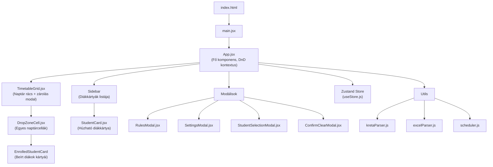
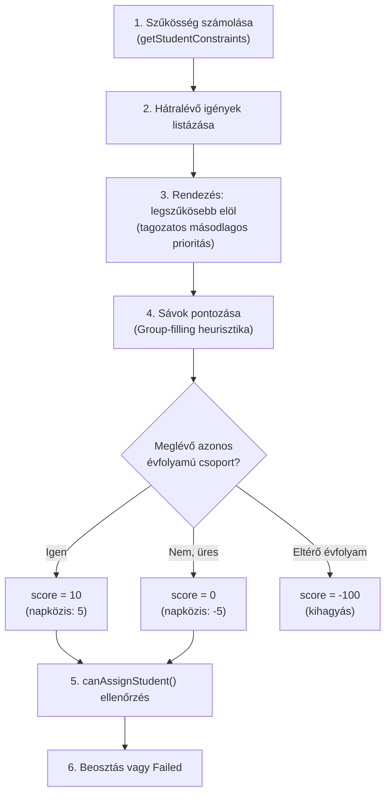

# Órarend Tervező – Teljes Projekt Elemzés

## Cél és kontextus
Fejlesztőpedagógusok számára készült **kliensoldali webalkalmazás** (React + Vite), amely a KRÉTA rendszerből exportált osztályórarendek és tanulói listák alapján segíti a heti fejlesztő órarend összeállítását. Tisztán böngészőben fut, nincs backend.

**Verzió:** 1.6.1 | **Port:** 3000

---

## Architektúra áttekintés



---

## Fájlstruktúra és felelősségek

### Forráskód (`src/`)

| Fájl | Méret | Felelősség |
|------|-------|------------|
| `main.jsx` | 229B | Belépőpont, React root renderelés |
| `App.jsx` | 23KB | Fő komponens: DndContext, fejléc gombok, fájlkezelés, PDF export, sidebar, modálisok összekapcsolása |
| `index.css` | 6KB | Globális CSS változók, reset, glassmorphism, gombok, modál alap, tooltip, badge |
| `App.module.css` | 5KB | App layout, header, sidebar, kapacitás indikátor, scheduler modal |

### Store (`src/store/`)

| Fájl | Méret | Felelősség |
|------|-------|------------|
| `useStore.js` | 26KB | **Teljes állapotkezelés** (Zustand): students, classes, timetable, blockedPeriods, settings, validáció, CRUD műveletek |

### Segédeszközök (`src/utils/`)

| Fájl | Méret | Felelősség |
|------|-------|------------|
| `kretaParser.js` | 2.5KB | RTF/DOC formátumú KRÉTA órarendek kliensoldali feldolgozása |
| `excelParser.js` | 1.1KB | XLSX tanulólista (KRÉTA export) feldolgozása: Név (A oszlop) + Osztály (G oszlop) |
| `scheduler.js` | 5.5KB | Automata ütemező: constraint-based + group-filling heurisztikával |

### Komponensek (`src/components/`)

| Fájl | Felelősség |
|------|------------|
| `TimetableGrid.jsx` | 5×8-as naptár rács (Hétfő–Péntek, 1–8. óra), szerkeszthető cím, zárolás modal, heti óraszám badge |
| `DropZoneCell.jsx` | Egyetlen naptár cella: droppable zóna, szín-validáció, tooltip, csoportkód szerkesztés |
| `StudentCard.jsx` | Húzható diákkártya: név, osztály, igény, szűkösségi figyelmeztetés, kuka ikon |
| `RulesModal.jsx` | Súgó: 3 fül (Feltételek, Szabályok, Algoritmus) |
| `SettingsModal.jsx` | Beállítások: csoportlétszám, heti max óra, KRÉTA kód, számozási irány |
| `StudentSelectionModal.jsx` | Excel importálás utáni diákválasztó: keresés, szűrés, igénybeállítás |
| `ConfirmClearModal.jsx` | Naptár kiürítés megerősítő dialógus |

---

## Adatmodell (Zustand Store)

```javascript
{
  settings: {
    maxGroupSize: 5,                    // Max létszám egy csoportban
    allowManualGroupSizeOverride: false, // Manuális felülbírálás
    maxTeacherHours: 24,                // Pedagógus heti max óra
    teacherCode: '2',                   // KRÉTA csoportkód előtag
    groupNamingOrder: 'vertical',       // Számozás iránya
  },
  students: [                           // Beosztandó diákok
    { id: 'excel-1', name: 'Kovács Anna', classId: '3.a', needs: 2 }
  ],
  classes: {                            // KRÉTA órarendek
    '3.a': {
      'Hétfő': { 1: 'Matematika', 2: 'Rajz és vizuális kultúra', ... },
      'Kedd': { ... }
    }
  },
  timetable: {                          // Beosztott diákok naptára
    'Hétfő': { 1: ['excel-1', 'excel-3'], 2: [] }
  },
  blockedPeriods: {                     // Zárolt idősávok
    'Hétfő': { 5: 'Napközi', 6: 'Ebédeltetés' }
  },
  customGroupLabels: {                  // Felülírt csoportkódok
    'Hétfő-1': '2/1'
  },
  timetableTitle: 'Fejlesztőpedagógus...',
  activeStudentId: null                 // Éppen húzott diák ID
}
```

---

## Üzleti logika – Elhozhatósági szabályrendszer

### Alsó tagozat (1–4. osztály)

| Típus | Elhozható tantárgyak | 5–6. óra (napközi/üres) |
|-------|---------------------|------------------------|
| **Tagozatos** (`.a`, `.b`) | Rajz, Testnevelés | ✅ Elhozható |
| **Nem tagozatos** (`.c`) | Rajz, Testnevelés, Ének | ✅ Elhozható |

### Felső tagozat (5–8. osztály)

| Szabály | Részletek |
|---------|-----------|
| Tantárgy | **Kizárólag Testnevelés** – semmilyen más tárgyról nem elhozható |
| Lyukas 5–6. óra | Csak **manuálisan** (sárga figyelmeztetéssel) |

### Általános korlátok

- **Napi max 1 alkalom** – egy diák naponta csak egyszer vehető ki
- **Évfolyam-egyezés** – automata tiltja a keveredést; manuálisan felülbírálható (sárga figyelmeztetés)
- **Csoportlétszám** – alapértelmezetten max 5 fő/csoport
- **Pedagógus heti max óra** – alapértelmezetten 24 (max 26)
- **Zárolások** – Napközi, Ebédeltetés, Értekezlet, Ügyelet, Helyettesítés

---

## Automata ütemező algoritmus (`scheduler.js`)



---

## Drag & Drop rendszer

- **Motor:** `@dnd-kit/core` + `@dnd-kit/utilities`
- **Két forrástípus:**
  1. `Student` – oldalsávból húzott diák (`student-{id}` prefixszel)
  2. `EnrolledStudent` – naptárból áthelyezett diák (`enrolled-{id}-{day}-{period}` prefixszel)
- **Vizuális visszajelzés:**
  - Zöld háttér + tantárgynév badge = elhozható
  - Piros szaggatott keret + tooltip = nem elhozható
  - Sárga tooltip = figyelmeztetés (nem blokkoló)
- **DragOverlay:** Önálló lebegő réteg (`dropAnimation={null}`)
- **PointerSensor:** 5px elmozdulás küszöb (kattintás vs. húzás megkülönböztetés)

---

## Importálás / Exportálás

| Funkció | Formátum | Részletek |
|---------|----------|-----------|
| KRÉTA órarend beolvasás | `.doc` / `.rtf` | Saját RTF parser (`\\row`, `\\cell` feldolgozás) |
| Tanulói lista beolvasás | `.xlsx` | A oszlop = Név, G oszlop = Osztály |
| Projekt mentés | `.json` | Teljes állapot (students, classes, timetable, blockedPeriods, title) |
| Projekt visszatöltés | `.json` | `importData()` – teljes állapot felülírás |
| PDF export | `.pdf` | jsPDF + jspdf-autotable, vektorgrafikus, landscape A4, Roboto font |

---

## Függőségek

| Csomag | Verzió | Funkció |
|--------|--------|---------|
| `react` / `react-dom` | ^19.2.7 | UI keretrendszer |
| `zustand` | ^5.0.14 | Állapotkezelés |
| `@dnd-kit/core` | ^6.3.1 | Drag & Drop motor |
| `@dnd-kit/sortable` | ^10.0.0 | Sortable kiterjesztés (jelenlegi kódban nem használt) |
| `@dnd-kit/utilities` | ^3.2.2 | DnD segédeszközök |
| `jspdf` | ^4.2.1 | PDF generálás |
| `jspdf-autotable` | ^5.0.8 | PDF táblázat |
| `lucide-react` | ^1.24.0 | Ikonok |
| `mammoth` | ^1.12.0 | .docx konverter (jelenlegi kódban nem használt aktívan) |
| `xlsx` | ^0.18.5 | Excel feldolgozás |

---

## CSS Architektúra

- **Módszer:** CSS Modules (`.module.css`) + globális `index.css`
- **Dizájn nyelv:** Glassmorphism (sötét mód, áttetszőség, blur, indigo árnyalatok)
- **Betűtípus:** Inter (Google Fonts, 300–700 súlyok)
- **Változók:** Központosított `:root` CSS custom properties

---

## Azonosított korlátok és ismert sajátosságok

1. **`@dnd-kit/sortable` telepítve, de nem használt** – a `package.json`-ban szerepel, de sehol nincs importálva
2. **`mammoth` csomag telepítve, de nem használt** – korábban .docx konverternek szánták, de a saját RTF parser lett a végleges
3. **`cleanStudentId` duplikáció** – exportált segédfüggvény, amelyet mind a store, mind a komponensek importálnak; központi `utils` helyre is kerülhetne
4. **Nincs routing** – egyoldalas alkalmazás, nincs React Router
5. **Nincs perzisztencia** – az állapot csak JSON fájlba menthető/tölthető, nincs localStorage/IndexedDB automatikus mentés
6. **Nincs undo/redo** – minden művelet végleges (kivéve a teljes naptár kiürítés)
7. **A beállítások nem mentődnek a JSON-ba** – a `handleSave` nem tartalmazza a `settings` objektumot
